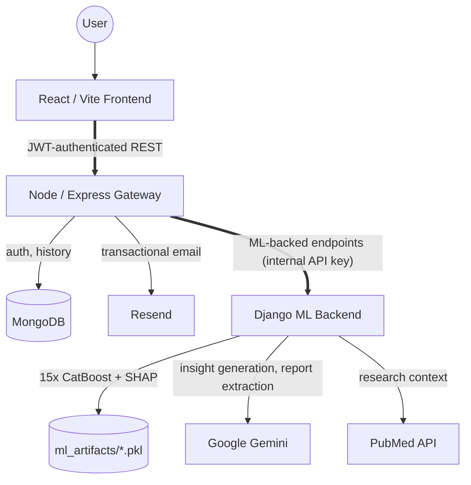

<div align="center">

# AMR-Insight

### AI-Powered Antibiotic Resistance Intelligence Platform

A research and education tool that predicts antibiotic resistance across 15 antibiotics from patient and lab data, using gradient-boosted models, native SHAP explainability, and WHO AWaRe classification.

[](docs/README.md)
[](ml-backend/requirements.txt)
[](ml-backend/requirements.txt)
[](ml-backend/requirements.txt)
[](frontend/package.json)
[](frontend/package.json)
[](gateway/package.json)
[](gateway/package.json)
[](LICENSE)

</div>

---

> **This is a research and education tool.** Predictions are trained on a Kaggle-sourced dataset and are **not** a clinical decision-support system. See [Known Limitations](docs/data/known-limitations.md) and [Non-Goals](docs/product/vision.md) for what this project explicitly does not claim to be.

## Table of Contents

- [Problem Statement](#problem-statement)
- [Solution](#solution)
- [Features](#features)
- [Tech Stack](#tech-stack)
- [System Architecture](#system-architecture)
- [Folder Structure](#folder-structure)
- [Screenshots / Demo](#screenshots--demo)
- [Installation](#installation)
- [Prediction Workflow](#prediction-workflow)
- [ML Pipeline](#ml-pipeline)
- [Dataset](#dataset)
- [Model Performance](#model-performance)
- [Explainable AI](#explainable-ai)
- [API](#api)
- [Security](#security)
- [Development Workflow](#development-workflow)
- [📚 Documentation](#-documentation)
- [Roadmap](#roadmap)
- [Contributing](#contributing)
- [Team](#team)
- [License](#license)
- [Acknowledgements](#acknowledgements)
- [Contact](#contact)

---

## Problem Statement

Antibiotic resistance (AMR) is a growing global health problem, and clinicians frequently need to choose an empirical antibiotic before culture and sensitivity results are available — a process that today relies heavily on local prescribing habits and general guidelines rather than patient-specific data. AMR-Insight explores whether patient demographics, clinical presentation, and organism identification can support that decision with a data-driven, explainable prediction — as a research and teaching artifact, not a replacement for microbiology testing or clinical judgment.

## Solution

AMR-Insight takes structured patient/clinical inputs (or an uploaded lab report, auto-parsed via an LLM extraction step) and returns a **Resistant / Susceptible / Intermediate** prediction for each of 15 antibiotics, each with a confidence score, a WHO AWaRe classification (Access/Watch/Reserve), and a native SHAP-based explanation of which clinical factors drove that specific prediction. Results are grounded against the model's own numeric outputs before being turned into natural-language insight text, specifically to prevent an LLM-generated summary from ever disagreeing with the model's actual R/S/I call.

## Features

| Feature | Description |
|---|---|
| Multi-antibiotic prediction | One request returns R/S/I predictions for all 15 antibiotics in a single response |
| Confidence scoring | Per-prediction confidence via each model's predicted class probability |
| Explainable AI | Per-prediction SHAP attribution, native to CatBoost (no external `shap` dependency) |
| WHO AWaRe classification | Every antibiotic tagged Access / Watch / Reserve |
| Lab report extraction | On the Prediction Input page, upload a PDF lab report; an LLM (Gemini)-assisted extraction step parses it and auto-fills the input fields for review |
| Trend exploration | Resistance trends across organisms/antibiotics, with LLM-generated explanatory insight |
| Prediction history | Authenticated users can filter and revisit past predictions (result, antibiotic, confidence, organism, date, free-text search) |
| PDF report export | Download a formatted PDF from either the Prediction Result page or the History page (client-side, via jsPDF) |
| Authentication | Email/OTP verification, JWT-based sessions, bcrypt password hashing |

**Explicitly out of scope for this release:** role-based access control and admin panels (single flat user type by design), two-factor authentication beyond signup/reset OTP. See [`docs/product/vision.md`](docs/product/vision.md) for the full non-goals list once written.

## Tech Stack

| Layer | Technology |
|---|---|
| ML Backend (P1) | Django + Django REST Framework, CatBoost (×15 models), native SHAP, Google Gemini (insight generation + report extraction), PubMed API (research context) |
| Gateway (P2) | Node.js, Express, MongoDB (Mongoose), JWT, bcrypt, Resend (transactional email) |
| Frontend (P3) | React 19, Vite, Tailwind CSS, Framer Motion, Recharts, Chart.js, jsPDF |
| Data | Kaggle AMR dataset (10,710 rows, 23 source columns), synthetic clinical feature augmentation, WHO AWaRe reference mapping |

## System Architecture

Three services: a React SPA talks to a Node/Express gateway, which owns authentication and prediction history, sends transactional email via Resend, and proxies several ML-backed endpoints to a Django backend that loads all 15 CatBoost models at startup and calls Gemini for insight generation and report extraction. There are two distinct PDF flows, in opposite directions: a user can *export* a prediction as a PDF client-side (via jsPDF) from either the Prediction Result page or the History page — the gateway is not involved — and a user can separately *upload* an existing lab report PDF on the Prediction Input page, which the gateway proxies to Django/Gemini for field extraction.

<div align="center">



</div>

The gateway proxies six endpoints to the Django backend: `/predict`, `/trends`, `/extract-report`, `/dataset-stats`, `/explain-trend`, and `/research-papers` — the diagram groups these under one edge for readability rather than listing all six.

A full low-level breakdown lives in [`docs/architecture/system-context.md`](docs/architecture/system-context.md) and [`docs/architecture/high-level-architecture.md`](docs/architecture/high-level-architecture.md)

## Folder Structure

```
amr-insight/
├── ml-backend/     # Django + DRF + CatBoost (×15) + SHAP + Gemini
├── gateway/        # Node/Express + MongoDB + JWT/OTP auth
├── frontend/       # React/Vite + Tailwind design system
├── docs/           # Full documentation set — see docs/README.md
└── .github/        # CODEOWNERS, issue templates, workflows
```

Full tree, including every `docs/` subcategory, lives in [`docs/README.md`](docs/README.md).

## Screenshots / Demo

Screenshots and a short feature-demo capture will be added here ahead of the Aug 1 presentation, dated under [`docs/assets/screenshots/`](docs/assets/screenshots/) per the asset-organization convention. Not yet populated — this section is a placeholder, not a claim.

## Installation

**Prerequisites:** Python 3.11+, Node.js 18+, MongoDB running locally (or a connection string), a Gemini API key, a PubMed API key (optional but recommended), a Resend API key.

### 1. ML Backend (Django)

```bash
cd ml-backend
python -m venv venv && source venv/bin/activate   # Windows: venv\Scripts\activate
pip install -r requirements.txt
cp .env.example .env   # fill in SECRET_KEY, GEMINI_API_KEY, PUBMED_API_KEY
python manage.py migrate
python manage.py runserver   # http://localhost:8000
```

### 2. Gateway (Node/Express)

```bash
cd gateway
npm install
cp .env.example .env   # fill in MONGO_URI, JWT_SECRET, RESEND_API_KEY
npm run dev   # http://localhost:5000
```

### 3. Frontend (React/Vite)

```bash
cd frontend
npm install
npm run dev   # http://localhost:5173 (Vite default)
```

Full per-service setup detail (env var reference, migration notes) lives in each service's own README and [`docs/deployment/environment-variables.md`](docs/deployment/environment-variables.md).

## Prediction Workflow

A user submits patient/clinical fields (or uploads a lab report for extraction) → the gateway attaches auth context and forwards the request to the ML backend → all 15 CatBoost models score the input in one pass → SHAP explanations and Gemini-generated insight text are attached → the gateway persists the result to prediction history and returns it to the frontend. Full sequence diagram: [`docs/architecture/request-lifecycle.md`](docs/architecture/request-lifecycle.md)

## ML Pipeline

15 per-antibiotic CatBoost classifiers, trained on a 47-column feature schema (19 original + 28 engineered from synthetic clinical variables), with model versions kept side-by-side on disk (`_v2`, `_v3`) for rollback and comparison. Full training methodology, the feature-leakage fix, and pruning rationale: [`docs/ml/training-pipeline.md`](docs/ml/training-pipeline.md) and [`docs/data/synthetic-feature-methodology.md`](docs/data/synthetic-feature-methodology.md)

## Dataset

Source: a Kaggle-published AMR dataset — 10,710 rows, 23 original columns, covering 15 antibiotic targets across a Gram-negative organism panel, spanning 2020–2025. A portion of clinical features are synthetically generated and clearly labeled as such. Full feature-level reference: [`docs/data/data-dictionary.md`](docs/data/data-dictionary.md) Known dataset constraints (Gram-negative-only panel, MIMIC-IV access evaluated and not pursued): [`docs/data/known-limitations.md`](docs/data/known-limitations.md)

## Model Performance

Per-antibiotic accuracy/F1 figures will be published as a compact summary table here once the current model version is finalized and benchmarked, with the full per-antibiotic comparison in [`docs/ml/model-cards.md`](docs/ml/model-cards.md) Deliberately not filled in yet: these numbers change on every retrain, and a stale table here would actively mislead a reader who trusts it.

## Explainable AI

Every prediction includes a SHAP-based, per-feature contribution breakdown, computed deterministically via CatBoost's native `get_feature_importance(type='ShapValues')` rather than the external `shap` library (which carries a known dependency conflict in this project's Windows environment). Separately, Gemini generates a high-level summary and recommended next steps from a grounded set of prediction outcomes — result counts, AWaRe tiers, confidence levels. Gemini never receives SHAP values or the `shapExplanation` data itself. This is a deliberate separation, not an oversight: explainability and AI-generated insight are two independent outputs, so the natural-language summary can't contradict the feature-level explanation, because it's never in a position to reference it in the first place. Full design rationale: [ADR-0004: Explainability Strategy](docs/architecture/adr/ADR-0004-explainability-strategy.md)

## API

All endpoints are served through the gateway at `/api/predictor` and `/api/auth`, JWT-protected except signup/login/OTP flows. Example — `POST /api/predictor/predict`:

**Request**

```json
{
  "age": 54,
  "gender": "Female",
  "diabetes": true,
  "hypertension": false,
  "hospital_before": true,
  "infection_freq": 1,
  "year": 2026,
  "month": 7,
  "organism": "Escherichia coli",
  "specimen_source": "Urine",
  "ward_type": "General Ward"
}
```

**Response** (truncated to one antibiotic of 15)

```json
{
  "success": true,
  "data": {
    "predictions": [
      {
        "antibiotic": "CIP",
        "result": "Resistant",
        "awareCategory": "Watch",
        "confidence": 0.8123,
        "shapExplanation": [
          { "feature": "Previous_Antibiotic_Use", "contribution": 0.412, "direction": "positive", "value": 1 }
        ]
      }
    ],
    "aiInsights": "..."
  }
}
```

Full endpoint reference (all 7 `predictor` routes — 6 proxied to Django, plus `/history` querying MongoDB directly — all 8 `auth` routes, and the shared error-code catalog): [`docs/api/endpoint-reference.md`](docs/api/endpoint-reference.md), with the machine-readable contract at [`docs/api/openapi.yaml`](docs/api/openapi.yaml)

## Security

JWT-based sessions with bcrypt-hashed passwords and server-side revocation via a `tokenVersion` counter (invalidated on password reset or `POST /logout-everywhere`); signup, password-reset, and login flows are protected by email OTP verification, a separate per-account lockout on repeated failed logins, and per-endpoint rate limiting. Single flat user type — no RBAC or admin panel by design, given the current scope and timeline. Two-factor authentication beyond OTP is deferred, not implemented. This project completed a full security hardening pass — thirteen sequential sub-phases plus two emergency hotfixes, including a shared-secret trust boundary between the gateway and Django, a persistent audit trail, dependency-vulnerability scanning (including a fixed, confirmed RCE), and a 98-test automated suite. Full detail, including every known residual gap: [`docs/security/threat-model.md`](docs/security/threat-model.md) and [`SECURITY.md`](SECURITY.md).

## Development Workflow

**Branching:** work happens on a topic branch off `dev`, never directly on `dev` or `main`. Two prefixes, chosen by what the branch actually contains:
- `feature/description` — code changes (e.g. `feature/history-page-filters`)
- `docs/description` — documentation-only changes (e.g. `docs/foundation-suite`)

**Commits:** [Conventional Commits](https://www.conventionalcommits.org/) style — `type(scope): summary`, e.g. `docs: add synthetic feature methodology` or `fix(gateway): close NoSQL injection vector in history filters`. Common types: `feat`, `fix`, `docs`, `refactor`, `chore`.

**Merging:** PRs target `dev`; `dev` merges to `main` only at real milestones (feature freeze, a tagged release), never as routine flow.

**Decisions:** anything non-trivial and hard to reverse gets an [ADR](docs/architecture/adr/) — sequential, zero-padded, `ADR-NNNN-kebab-title.md`, and never renumbered or reused even if a later ADR supersedes it. The acting owner of the relevant area (see [Team](#team)) approves.

**Documentation-specific convention:** related documentation files that land together as one unit (e.g. an entire roadmap phase) can share a single branch and a single review pass, with individual commits per file — this repo's own `docs/` build followed that pattern rather than one branch per file.

Full contribution process (issue templates, review expectations, doc-ownership succession) will live in [`CONTRIBUTING.md`](CONTRIBUTING.md) once written — the above is the real, currently-practiced workflow, not a future aspiration.

## 📚 Documentation

| I am a... | Start here |
|---|---|
| Recruiter / casual visitor | This README only — you likely don't need to go further |
| Professor / academic reviewer | `docs/product/problem-statement.md` → `docs/data/known-limitations.md` → `docs/architecture/system-context.md` |
| Developer (new contributor) | [`docs/README.md`](docs/README.md) → relevant service README → relevant ADRs |
| ML Engineer | `docs/ml/` → `docs/data/data-dictionary.md` → `docs/ai/` |
| Researcher | `docs/data/synthetic-feature-methodology.md` → `docs/research/` |
| Future maintainer | `docs/architecture/adr/` (all of them, in order) |

## Roadmap

Feature freeze reached, demo delivered July 29, final presentation August 1. Documentation is being actively built post-freeze — see [`docs/product/roadmap.md`](docs/product/roadmap.md) for the full project roadmap.

## Contributing

Not yet open to external contributors — this is currently a 3-person academic team project. `CONTRIBUTING.md` will cover the branching/PR process above in more detail once written.

## Team

| Name | Owns |
|---|---|
| Dhyey | P1 — ML backend (Django, CatBoost × 15, SHAP, Gemini insights/extraction) and P2 — Gateway (Node/Express, MongoDB, auth) |
| Urva | P3 — Frontend (React/Vite, design system) |
| Ansh | P3 — Frontend (React/Vite, design system) |

## License

Licensed under the [Apache License, Version 2.0](LICENSE).

## Acknowledgements

- Dataset: Kaggle-published AMR dataset (source-specific citation to be added — see `CITATION.cff`)
- WHO AWaRe antibiotic classification framework
- CatBoost, Django REST Framework, React, and the broader open-source ecosystem this project builds on

## Contact

| Name | Role | GitHub | LinkedIn |
|---|---|---|---|
| Dhyey | P1 (ML backend) + P2 (Gateway) | [@dhyeydaftary](https://github.com/dhyeydaftary) | [in/dhyey-daftary](https://www.linkedin.com/in/dhyey-daftary/) |
| Urva | P3 (Frontend) | [@urvashah05](https://github.com/urvashah05) | [in/urva-shah](https://www.linkedin.com/in/urva-shah-2b289a30b/) |
| Ansh | P3 — Frontend | [@anshpatel0910](https://github.com/anshpatel0910) | [in/anshpatel091006](https://www.linkedin.com/in/anshpatel091006/) |