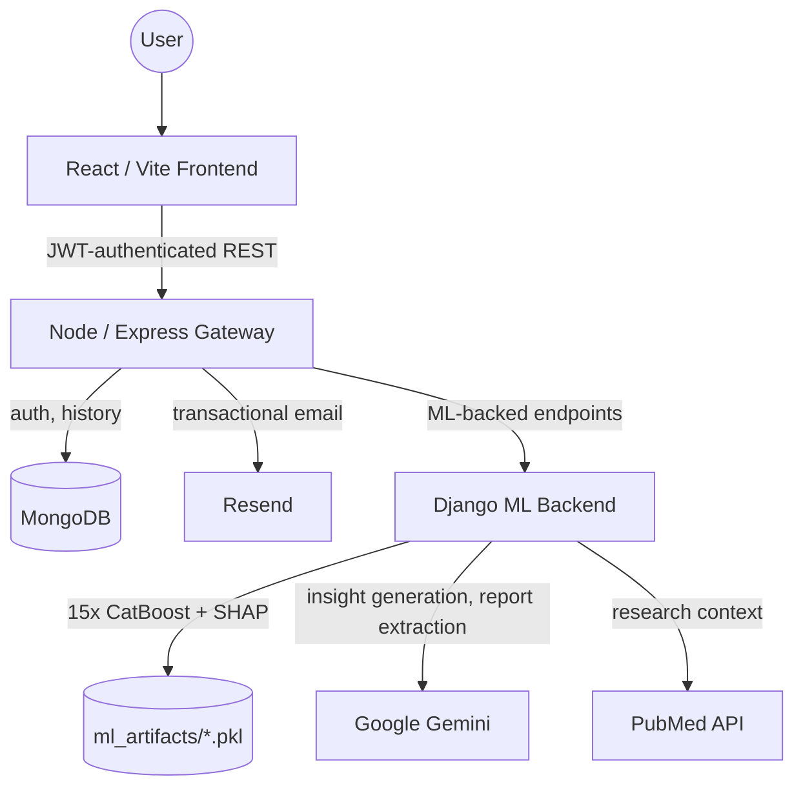
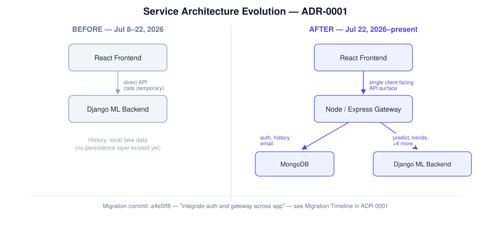

# ADR-0001: Three-Service Architecture

## Status

Accepted.

## Context

AMR-Insight runs as three services: a React/Vite frontend, a Node/Express gateway, and a Django ML backend. This wasn't the architecture from day one — it's the result of a real migration, verifiable in git history, not a design decided once and left unchanged. This ADR documents that evolution and the reasoning that can actually be evidenced from it, rather than presenting the current architecture as if it had always been the plan.

## Migration Timeline

| Date | Commit | What changed |
|---|---|---|
| Jul 8, 2026 | `41090a0` | Frontend connects **directly to Django** for predictions (`DJANGO_BASE_URL = 'http://127.0.0.1:8000/api/predictor'`). Commit message explicitly calls this "temporary, until Node/Mongo exists"; History falls back to local fake data in the meantime. |
| Jul 8–17, 2026 | `81c30be`, `9cd78c9`, `6b6b00b` | Gateway scaffolded: `.env.example`, `package.json`, Express server entry point with a MongoDB connection. No routes yet. |
| ~Jul 17–20, 2026 | `a7c89e5`, `1aa6989`, `3fda7e0` | **Auth built first** — signup route with password hashing, login route, User model schema. This is net-new functionality; Django never had any user/auth logic to move out of. |
| ~Jul 20, 2026 | `376545b` | PredictionHistory model schema added — also net-new; no prior persistence layer existed anywhere in the project. |
| ~Jul 20–22, 2026 | `380c10c`, `cbfa70c`, `34096af` | Gateway gains a `/predict` proxy route (to Django), `/trends` and `/dataset-stats` forwarding routes, and a `/history` route. |
| Jul 22, 2026 | `a4e5ff8` | **The migration commit.** Message: *"switch predictionApi and trendsApi from Django to gateway."* Same commit wires up `AuthContext`, a shared axios instance pointing at the gateway, and `historyApi`. From this point on, the frontend talks only to the gateway. |

## Decision

**Frontend → Node/Express Gateway → Django ML Backend**, with the gateway owning authentication, prediction history, and email, and proxying six ML-backed endpoints to Django.

This decision is evidenced two ways, and it's worth being precise about which is which:

**Directly evidenced — why the gateway exists at all:** the gateway was built specifically to add authentication and persistent prediction history, neither of which ever existed in Django. A repository-wide check confirms Django never had any custom user or auth code — the only `django.contrib.auth` references are unused default project scaffold. Auth and history aren't capabilities that moved from Django to the gateway; they were always new, and always built there.

**Directly evidenced — why prediction/trends calls were consolidated into the gateway too:** for about two weeks, the frontend called Django directly for predictions while the gateway was being built out for auth and history. That arrangement — the "frontend talks to multiple backends directly" alternative — wasn't just considered, it was actually running in production-bound code. It was then deliberately replaced, in one commit, once the gateway existed: `a4e5ff8` explicitly switches `predictionApi` and `trendsApi` from calling Django to calling the gateway, in the same commit that finishes wiring up auth. The plausible reason — a single client-facing API surface rather than the frontend juggling two backends for unrelated purposes — is a reasonable reading of that commit, but the commit message doesn't state a reason explicitly, so this ADR presents it as the most likely interpretation of the evidence, not a confirmed historical rationale.

**Not evidenced — Node hosting the ML logic itself:** no trace of this alternative exists anywhere in this project's history. It's named below as a theoretical alternative, not as something this project ever evaluated and rejected.

## Current Architecture

This is the same diagram maintained in the root [`README.md`](../../../README.md#system-architecture) — kept here for a self-contained architectural record, but the README is the version to update first if the architecture changes; this copy should be kept in sync with it, not edited independently.

## Alternatives Considered

| Alternative | Why not adopted |
|---|---|
| Frontend → Django directly | Actually implemented and run for ~2 weeks (Jul 8–22), then deliberately migrated away from once the gateway existed for auth and history. Not a hypothetical — this was the project's real first architecture. |
| Frontend → multiple backend services directly | This describes the same Jul 8–22 period once the gateway had some routes (history) but predictions still hit Django directly — i.e. the transitional state between the two states above, not a separately evaluated design. |
| Node.js hosting the ML logic itself | No evidence this was ever considered. CatBoost, SHAP, and the Python ML tooling this project depends on have no equivalent path in Node without a substantial rewrite; named here as a theoretical alternative only. |

## Consequences

- Every ML-backed request takes an extra network hop (frontend → gateway → Django) compared to a direct call. A concrete, evidenced cost of this: local network testing required a `VITE_GATEWAY_URL` environment override (`6aab7bb`) that wouldn't have been needed with a single backend.
- Two backend services now need independent configuration, deployment, and startup, rather than one.
- In exchange, the frontend has one consistent, JWT-authenticated API surface, and capabilities the project needed — persistent per-user history, authentication — didn't have to be built into Django, which has no first-party model for either in this project's actual usage.
- This three-service split is the foundation both [ADR-0003](ADR-0003-prediction-model-strategy.md) (which model runs inside the Django service) and [ADR-0004](ADR-0004-explainability-strategy.md) (how that service's explainability output reaches the frontend) build on. Any future change to this architecture would need to account for both.

## Related Documentation

- Root [`README.md`](../../../README.md#system-architecture) — the current-state Mermaid diagram, kept in sync with the one above
- [ADR-0003: Prediction Model Strategy](ADR-0003-prediction-model-strategy.md)
- [ADR-0004: Explainability Strategy](ADR-0004-explainability-strategy.md)