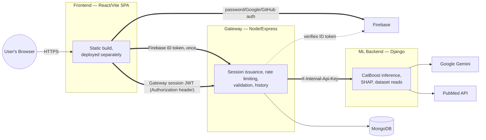

# High-Level Architecture

## Purpose

[`docs/architecture/system-context.md`](system-context.md) deliberately treats AMR-Insight as a single box, showing only its outermost boundary — the User, Gemini, PubMed, and the training dataset. This document is one level down: the internal structure inside that box, the three services that make it up, how they actually talk to each other, and the trust boundary each hop crosses. For the request-by-request detail of one specific flow through this structure, see [`docs/architecture/request-lifecycle.md`](request-lifecycle.md); for why this three-service split exists at all rather than a simpler alternative, see [ADR-0001](adr/ADR-0001-three-service-architecture.md).

 

 

Per [ADR-0005](adr/ADR-0005-firebase-auth-migration.md), authentication is now layered: Firebase is the **identity provider** (password, Google, GitHub — the frontend talks to it directly), while the Gateway remains the **session/authorization authority**, issuing its own JWT after verifying a Firebase-issued ID token exactly once at login. Every subsequent request uses that Gateway-issued token, not a raw Firebase token — the thick arrows still mark the two request-level trust boundaries that matter for authorization (`Gateway session JWT`, `X-Internal-Api-Key`); the two thin arrows show the identity-verification step that happens once, at login, not on every request.

## The Three Services

**Frontend (React/Vite).** A pure client-side single-page app, built once (`vite build`) into static files and deployed independently of the other two services — there is no server in this repository that serves the built frontend. It never calls Django directly; every request goes through the gateway, over the one shared axios instance every page uses (see [ADR-0001](adr/ADR-0001-three-service-architecture.md) for why that consolidation happened). **The frontend is treated as an untrusted client, architecturally, not just in practice** — every security-sensitive decision (password policy, login lockout, rate limits, account-enumeration protection, and everything else described in [`docs/security/threat-model.md`](../security/threat-model.md)) is enforced server-side regardless of what the frontend's own client-side validation says. The frontend's checks exist for user experience — fast feedback without a round trip — not as a security boundary; a request that skips the browser entirely and calls the gateway directly is held to exactly the same rules.

**Gateway (Node/Express).** The sole authenticated entry point to the whole system. Verifies a Firebase-issued ID token once at login (see [ADR-0005](adr/ADR-0005-firebase-auth-migration.md)) and issues its own downstream session JWT from that point on — the actual authorization mechanism for every subsequent request remains this service's own, per [ADR-0006](adr/ADR-0006-session-and-token-security-architecture.md), not Firebase's token directly. Owns the MongoDB `User` record (associated by Firebase UID), prediction history, and outbound email (welcome messages, via Resend — OTP delivery is Firebase's own responsibility now). Every request that reaches Django or MongoDB passes through this service first — nothing else in the system has a direct path to either. Also owns the security controls that don't belong to a specific downstream service: CORS, security headers (`helmet`), and per-user rate limiting.

**ML Backend (Django).** Owns the actual prediction logic — 15 CatBoost models (loaded once at process startup, not per request; see [ADR-0003](adr/ADR-0003-prediction-model-strategy.md)), SHAP explainability, the trends/dataset-statistics endpoints (served from an in-memory-cached CSV, not a database), and the two external integrations (Gemini, PubMed). Has no user model, no sessions, and no concept of "who is logged in" — it doesn't need one, since access control here works differently from the gateway (see below).

## Trust Boundaries

Two different authentication mechanisms exist in this system, deliberately, because they're solving two different problems:

**User → Gateway: a JWT, because there's a real user identity to verify.** Issued at login, carrying `userId` and a `tokenVersion` claim checked against the account's current value on every request — the mechanism that makes server-side session revocation possible (password reset, `POST /logout-everywhere`). Full detail: [ADR-0006](adr/ADR-0006-session-and-token-security-architecture.md).

**Gateway → Django: a static shared secret, because there's no user identity to check — only a service identity.** Django doesn't need to know *which user* is asking; it needs to know the request came from the gateway and not from anyone else who can reach the Django host on the network. `InternalApiKeyMiddleware` checks a shared `X-Internal-Api-Key` header, via constant-time comparison, before any view logic runs. This distinction matters because Django was originally protected by nothing except `CORS_ALLOWED_ORIGINS` — which stops a *browser* from calling it cross-origin, but does nothing against a direct script or `curl` request. That gap, and why a shared-key middleware was the right fix rather than, say, trying to route Django's user concept through the same JWT the gateway uses, is covered in full in [`docs/security/threat-model.md`](../security/threat-model.md)'s Authorization section.

**Gateway → MongoDB is deliberately not treated as a third trust boundary of the same kind.** It does have real authentication — the connection string (`MONGO_URI`) carries actual database credentials — but that authentication happens once, at connection time, for exactly one possible caller: the gateway is the only service in this system that ever connects to MongoDB at all (Django never touches it directly). There's no "which of several possible callers is this" question to resolve the way there is for the two boundaries above, where a JWT distinguishes between many different real users and the internal API key distinguishes the gateway from anyone else who might reach Django — so this is standard infrastructure-level access control, not a per-request application-level check, and doesn't need the same architectural treatment.

## What This Document Does Not Cover

This is a structural view — what exists and how it's connected, not what happens during any specific request (that's [`docs/architecture/request-lifecycle.md`](request-lifecycle.md)), and not the reasoning behind each individual security control added to this structure over time (that's [`docs/security/threat-model.md`](../security/threat-model.md), organized by hardening sub-phase). MongoDB's schema and collections aren't detailed here either — see the model files directly (`gateway/models/`) for that level of detail; this document only shows that the gateway is the one service with a connection to it at all.

## Related Documentation

- [`docs/architecture/system-context.md`](system-context.md) — the external-boundary view this document is one level down from
- [`docs/architecture/request-lifecycle.md`](request-lifecycle.md) — one real request traced through this structure, step by step
- [`docs/architecture/adr/ADR-0001-three-service-architecture.md`](adr/ADR-0001-three-service-architecture.md) — why this three-service split exists, evidenced against actual git history
- [`docs/architecture/adr/ADR-0006-session-and-token-security-architecture.md`](adr/ADR-0006-session-and-token-security-architecture.md) — the User → Gateway trust boundary in full detail
- [`docs/security/threat-model.md`](../security/threat-model.md) — the Gateway → Django trust boundary (`InternalApiKeyMiddleware`) in full detail, plus every other security control layered onto this structure