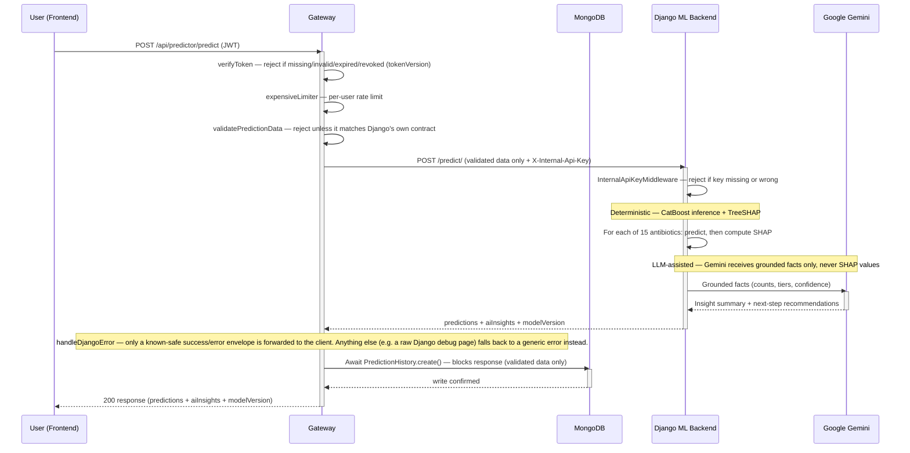

# Prediction Lifecycle

## Purpose

This document traces a single `/predict` request end-to-end — every hop, in the exact order the code actually executes them, verified directly against `gateway/routes/prediction.js` and `ml-backend/predictor/views.py` rather than described from memory. It's the implementation-level complement to the conceptual [Prediction Workflow](../../README.md#prediction-workflow) summary in the root README, and to [`docs/architecture/system-context.md`](system-context.md)'s external-boundary view — this is the one document in the set that actually shows the request as a sequence, not a static structure.

This version reflects the request as it stands after the project's security hardening pass — the original sequence (auth check → proxy to Django → persist → respond) is unchanged in shape, but four real controls now sit inside it that didn't exist in the earlier version of this document: per-user rate limiting, gateway-side payload validation, **authenticated Gateway-to-Django communication via an internal service API key**, and a safety net on what the gateway is willing to forward back to the client. Full detail on why each exists: [`docs/security/threat-model.md`](../security/threat-model.md).

## Request Execution Sequence

1. **Frontend → Gateway.** The frontend sends `POST /api/predictor/predict` with a JWT in the `Authorization` header. This is the same shared axios instance used for every gateway call — no direct call to Django exists anywhere in the frontend (see [ADR-0001](adr/ADR-0001-three-service-architecture.md) for why).
2. **Auth check.** `verifyToken` middleware runs first, before any other logic. A missing, malformed, or expired token short-circuits the request here — but so does a structurally valid, correctly signed token whose embedded `tokenVersion` no longer matches the account's current value, which is what actually makes server-side session revocation possible (a password reset or a `/logout-everywhere` call invalidates every token issued before that point, even ones that haven't naturally expired). Full reasoning: [ADR-0006](adr/ADR-0006-session-and-token-security-architecture.md).
3. **Rate limiting.** `expensiveLimiter` runs next, keyed per authenticated user (not per IP) — `/predict` triggers real downstream cost (a Gemini API call inside Django), so this route sits in the tighter of the two rate-limit tiers gateway-side routes use. A request that fails `verifyToken` never reaches this check at all; the limiter only ever sees requests from a real, currently-valid session.
4. **Gateway-side validation.** `validatePredictionData` checks the request body against the same field contract Django's own `PredictionRequestSerializer` enforces — types, allow-listed choices, numeric ranges — *before* anything is sent to Django. A request that fails here never reaches Django at all, and the *validated, whitelisted* shape (not the raw request body) is what continues to every step after this one, including the eventual MongoDB write in step 11. **Django validates the same payload again, independently, once it arrives** (step 7) — this is intentional defense-in-depth, not redundant duplication: the gateway's check exists to reject bad requests early and keep malformed data out of what eventually gets persisted, but Django's own serializer is still the authoritative gate on its side and doesn't trust the gateway's validation to have been correct or even to have run at all.
5. **Gateway → Django.** The gateway forwards the validated patient data to Django's `/predict/` endpoint via a synchronous `axios.post` call, carrying an `X-Internal-Api-Key` header — the shared secret that proves this request actually came from the gateway, not an arbitrary client that happened to reach the Django host directly. This is a blocking call with a 30-second timeout; a request that hangs longer than that returns a `504 UPSTREAM_TIMEOUT` to the frontend rather than waiting indefinitely.
6. **Service-to-service auth.** `InternalApiKeyMiddleware` is the first thing in the Django middleware chain that enforces access control — a request without the correct key is rejected before any view logic, URL routing internals, or request parsing runs. (It isn't the literal first middleware in the chain — `SecurityMiddleware` runs before it, handling HSTS/SSL-redirect concerns unrelated to authentication — but it's the first thing that actually decides whether this request is allowed to proceed at all.) This is the real enforcement boundary for the whole Django service; `CORS_ALLOWED_ORIGINS` (also configured) only stops a *browser* from calling Django cross-origin, which does nothing against a direct script or `curl` request.
7. **Inference.** Django's `predict_view` first validates the incoming payload via `PredictionRequestSerializer` (see step 4's note on why this happens again here), then loops over all 15 already-loaded CatBoost models (loaded once at process startup, not per request — see [ADR-0003](adr/ADR-0003-prediction-model-strategy.md)), predicting and computing that antibiotic's SHAP explanation together in the same iteration — not as two separate passes over all 15.
8. **Insight generation.** `generate_ai_insights()` is called synchronously, in the same request — this is not a background job or a separate async step. Per [ADR-0004](adr/ADR-0004-explainability-strategy.md), Gemini receives only aggregate grounding facts (result counts, AWaRe tiers, confidence groupings), never the SHAP data itself.
9. **Django → Gateway.** A single response carries `predictions` (each with its SHAP explanation), `aiInsights`, and `modelVersion` back to the gateway.
10. **Safe error handling, on the failure path.** If Django's response is ever an error rather than a success, the gateway only forwards it to the client verbatim if it matches the application's own known-safe `{success, data, error}` envelope shape. Anything else — most importantly, what Django's debug page would look like if `DEBUG` were ever left on in a real deployment and an unhandled exception occurred — falls back to a generic error instead, with the actual (safe, non-sensitive) detail logged server-side only. This doesn't appear as a step in the happy-path diagram above because it only does anything on the failure path, but it sits in the same code that handles every response from Django, success or failure.
11. **History write — before the response, not after.** The gateway `await`s `PredictionHistory.create()` — a blocking call that only resolves once MongoDB confirms the write — *before* responding to the frontend, using the validated data from step 4, not the original raw request body. This means a slow or failed database write directly delays or fails the user-facing response; there's no fire-and-forget here.
12. **Gateway → Frontend.** Only after the history write completes does the gateway return the final `200` response with the predictions, insights, and model version.

## What This Sequence Does Not Show

Five other endpoints (`/extract-report`, `/trends`, `/dataset-stats`, `/explain-trend`, `/research-papers`) follow the same overall shape — `verifyToken` → rate limit → proxy-to-Django (with the same `InternalApiKeyMiddleware` check and safe-error-handling on Django's side) — but aren't traced individually here, since this document covers `/predict` specifically as the primary, most-referenced flow in the rest of this doc set. A few differences worth knowing if you're reasoning about those other routes from this diagram: `/trends`, `/dataset-stats`, `/explain-trend`, and `/history` sit in the looser rate-limit tier (`readLimiter`), not the tighter one shown here; `/history` never calls Django at all — it queries MongoDB directly, scoped to the authenticated user's own records; `/trends` and `/explain-trend` do **not** involve Gemini or SHAP at all (see ADR-0004's note that `trend_insights.py` is fully deterministic); and `/extract-report` has its own additional file-upload validation (MIME type, magic-byte content check, and a server-generated filename that never forwards anything from the client) not shown here since it doesn't apply to `/predict`.

## Related Documentation

- [`docs/architecture/system-context.md`](system-context.md) — the external-boundary view this document's internal detail complements
- [`docs/architecture/adr/ADR-0001-three-service-architecture.md`](adr/ADR-0001-three-service-architecture.md) — why the gateway sits between frontend and Django at all
- [`docs/architecture/adr/ADR-0003-prediction-model-strategy.md`](adr/ADR-0003-prediction-model-strategy.md) — why all 15 models load at startup, not per request
- [`docs/architecture/adr/ADR-0004-explainability-strategy.md`](adr/ADR-0004-explainability-strategy.md) — why Gemini never receives SHAP data, detailed here in prose form as a sequence
- [`docs/architecture/adr/ADR-0006-session-and-token-security-architecture.md`](adr/ADR-0006-session-and-token-security-architecture.md) — the `tokenVersion` revocation mechanism behind step 2
- [`docs/security/threat-model.md`](../security/threat-model.md) — full detail on every control added in steps 2–6 and 10, and why each exists