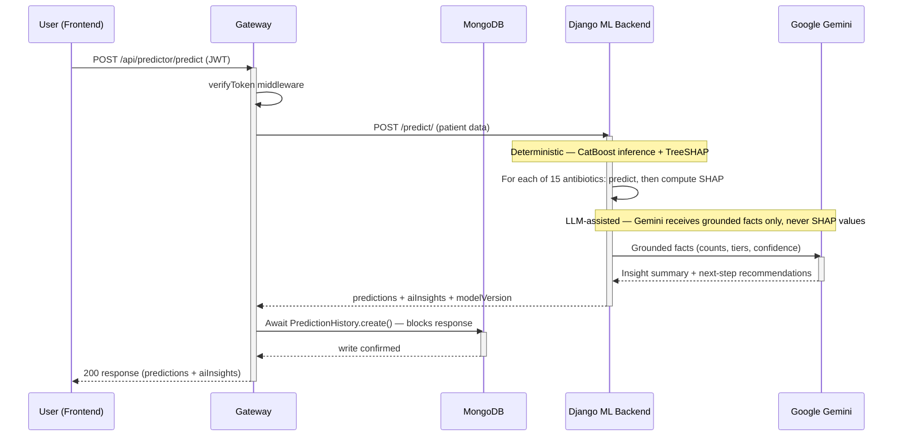

# Prediction Lifecycle

## Purpose

This document traces a single `/predict` request end-to-end — every hop, in the exact order the code actually executes them, verified directly against `gateway/routes/prediction.js` and `ml-backend/predictor/views.py` rather than described from memory. It's the implementation-level complement to the conceptual [Prediction Workflow](../../README.md#prediction-workflow) summary in the root README, and to [`docs/architecture/system-context.md`](system-context.md)'s external-boundary view — this is the one document in the set that actually shows the request as a sequence, not a static structure.

## Request Execution Sequence

1. **Frontend → Gateway.** The frontend sends `POST /api/predictor/predict` with a JWT in the `Authorization` header. This is the same shared axios instance used for every gateway call — no direct call to Django exists anywhere in the frontend (see [ADR-0001](adr/ADR-0001-three-service-architecture.md) for why).
2. **Auth check.** `verifyToken` middleware runs first, before any other logic. A missing or invalid token short-circuits the request here — Django is never reached for an unauthenticated call.
3. **Gateway → Django.** The gateway forwards the raw patient data to Django's `/predict/` endpoint via a synchronous `axios.post` call. This is a blocking call — the gateway waits for Django's full response before doing anything else.
4. **Inference.** Django's `predict_view` loops over all 15 already-loaded CatBoost models (loaded once at process startup, not per request — see [ADR-0003](adr/ADR-0003-prediction-model-strategy.md)), predicting and computing that antibiotic's SHAP explanation together in the same iteration — not as two separate passes over all 15.
5. **Insight generation.** `generate_ai_insights()` is called synchronously, in the same request — this is not a background job or a separate async step. Per [ADR-0004](adr/ADR-0004-explainability-strategy.md), Gemini receives only aggregate grounding facts (result counts, AWaRe tiers, confidence groupings), never the SHAP data itself.
6. **Django → Gateway.** A single response carries `predictions` (each with its SHAP explanation), `aiInsights`, and `modelVersion` back to the gateway.
7. **History write — before the response, not after.** The gateway `await`s `PredictionHistory.create()` — a blocking call that only resolves once MongoDB confirms the write — *before* responding to the frontend. This means a slow or failed database write directly delays or fails the user-facing response; there's no fire-and-forget here.
8. **Gateway → Frontend.** Only after the history write completes does the gateway return the final `200` response with the predictions and insights.

## What This Sequence Does Not Show

Five other endpoints (`/extract-report`, `/trends`, `/dataset-stats`, `/explain-trend`, `/research-papers`) follow the same `verifyToken` → proxy-to-Django pattern but aren't traced here individually — this document covers `/predict` specifically because it's the primary, most-referenced flow in the rest of this doc set. `/trends` and `/explain-trend` in particular do **not** involve Gemini or SHAP at all (see ADR-0004's note that `trend_insights.py` is fully deterministic) — worth knowing so this diagram isn't mistaken for describing every gateway-to-Django call.

## Related Documentation

- [`docs/architecture/system-context.md`](system-context.md) — the external-boundary view this document's internal detail complements
- [`docs/architecture/adr/ADR-0001-three-service-architecture.md`](adr/ADR-0001-three-service-architecture.md) — why the gateway sits between frontend and Django at all
- [`docs/architecture/adr/ADR-0003-prediction-model-strategy.md`](adr/ADR-0003-prediction-model-strategy.md) — why all 15 models load at startup, not per request
- [`docs/architecture/adr/ADR-0004-explainability-strategy.md`](adr/ADR-0004-explainability-strategy.md) — why Gemini never receives SHAP data, detailed here in prose form as a sequence