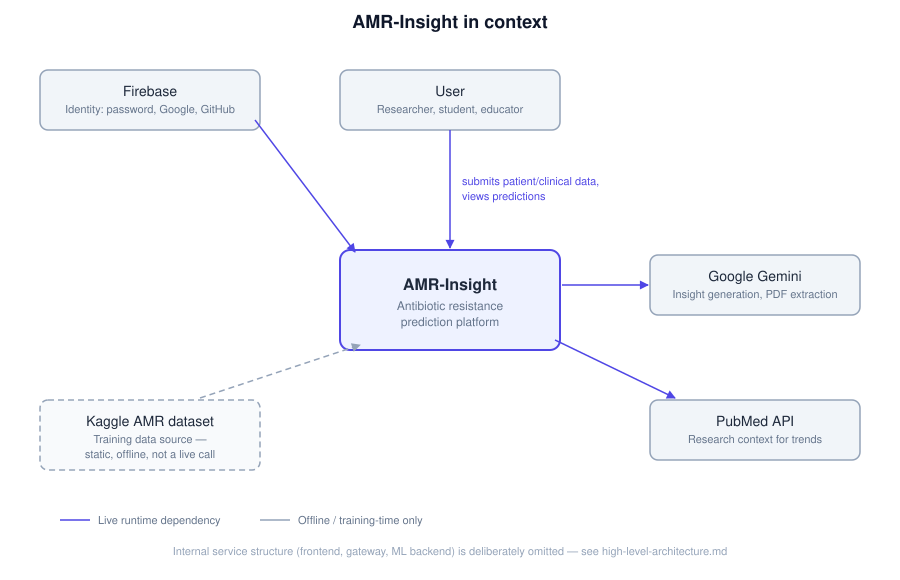

# System Context

## Purpose

This document establishes AMR-Insight's boundary — what's inside the system versus what's an external actor or dependency it talks to. It's deliberately the highest-level architectural view in this project: a single box for the whole platform, with only its outermost relationships shown. Internal service structure (the frontend/gateway/ML-backend split) is out of scope here by design; that detail lives in [`docs/architecture/high-level-architecture.md`](high-level-architecture.md), one level down.

## External Actors and Systems

**User** — a researcher, student, or educator, not a clinician acting on live patient care (see [`docs/data/known-limitations.md`](../data/known-limitations.md) for why this tool is not a clinical decision-support system). Submits patient/clinical data and views predictions; this is the only human actor in the system.

**Google Gemini** — a live, runtime dependency used for two independent features: generating grounded natural-language insight summaries and next-step recommendations from prediction results, and extracting structured fields from an uploaded lab report PDF. Full detail on why and how: [ADR-0004](adr/ADR-0004-explainability-strategy.md).

**PubMed API** — a live, runtime dependency called only for the Research Papers / trend-explanation feature, supplying research context. This is a separate concern from Gemini and is not routed through it — see ADR-0004's note that `pubmed_client.py` is never imported by the insight-generation code path.

**Kaggle AMR dataset** — the source of the training data, shown with a dashed boundary because it is fundamentally different in kind from the other three: it's a static, offline artifact consumed once (at training time and dataset-generation time), not a service AMR-Insight calls at runtime. Full provenance and constraints: [`docs/data/known-limitations.md`](../data/known-limitations.md).

## Related Documentation

- [`docs/architecture/high-level-architecture.md`](high-level-architecture.md) — the internal three-service structure this document deliberately omits
- [`docs/architecture/adr/ADR-0001-three-service-architecture.md`](adr/ADR-0001-three-service-architecture.md) — why that internal structure exists
- [`docs/architecture/adr/ADR-0004-explainability-strategy.md`](adr/ADR-0004-explainability-strategy.md) — the Gemini and PubMed integrations in detail
- [`docs/data/known-limitations.md`](../data/known-limitations.md) — the Kaggle dataset's provenance and constraints, and why the User actor is framed as research/education, not clinical