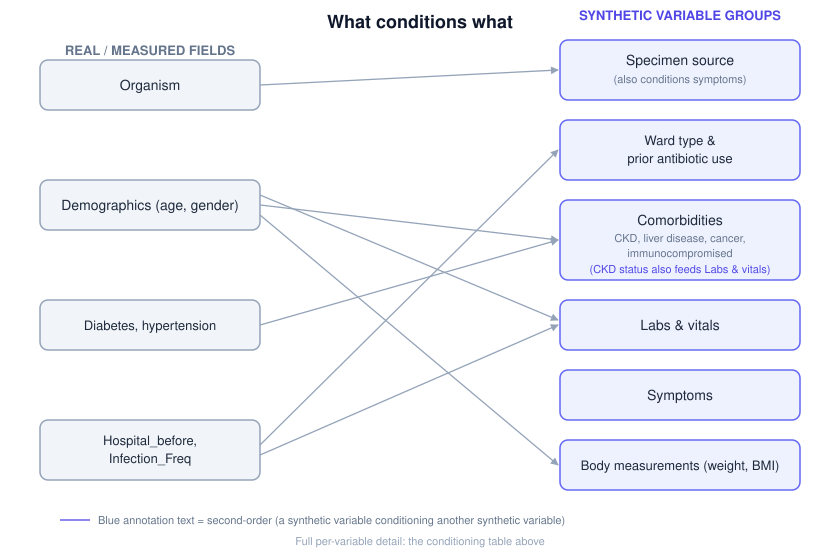
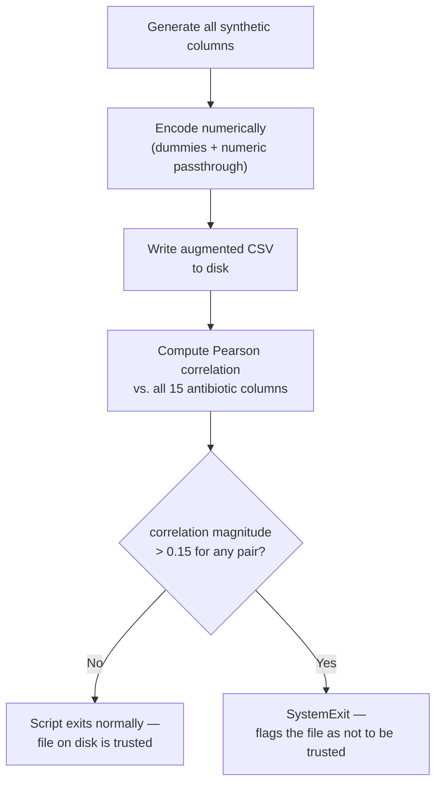

# Synthetic Feature Methodology

## Purpose

AMR-Insight's Kaggle-sourced dataset carries a limited set of real clinical fields. To build a feature set rich enough for meaningful antibiotic-resistance prediction, a set of clinical variables is synthetically generated — sampled from conditional distributions grounded in real clinical epidemiology, rather than pulled from actual patient records. This document explains how those variables are generated, what boundaries were deliberately placed on them to avoid target leakage, why four of them were later removed, and the resulting version history of the feature schema.

This document does not cover the core dataset's original columns — see [`docs/data/data-dictionary.md`](data-dictionary.md) for the full feature reference, real and synthetic combined.

## Conditioning Principle

Every synthetic column is generated in `ml-backend/predictor/generate_synthetic_features.py`, conditioned **only on pre-outcome real columns already present in the dataset** — `Organism`, `Age`, `Gender`, `Diabetes`, `Hypertension`, `Hospital_before`, `Infection_Freq`. No synthetic column is ever conditioned on any of the 15 antibiotic AST result columns, or on anything derived from them. This constraint is the single governing rule behind the entire script, and it is what makes the resulting features safe to train on.

## What Each Variable Is Conditioned On

| Variable(s) | Conditioned on | Clinical rationale |
|---|---|---|
| `Ward_Type` | `Hospital_before`, `Infection_Freq` | Prior hospitalization and higher infection frequency raise ICU admission probability |
| `Specimen_Source` | `Organism` | Per-organism prior distributions over specimen type — e.g. *E. coli* skews heavily toward urine (a classic UTI pathogen); *Acinetobacter baumannii* skews toward respiratory/catheter specimens (a classic ICU/device-associated organism) |
| `Previous_Antibiotic_Use` | `Hospital_before`, `Infection_Freq` | Prior hospitalization and repeat infection both raise the prior probability of previous antibiotic exposure |
| `CKD_Status`, `Liver_Disease`, `Cancer`, `Immunocompromised_Status` | `Age`, `Diabetes`, `Hypertension` | Standard comorbidity epidemiology: CKD risk rises with age, diabetes, and hypertension; liver disease and cancer risk rise with age; immunocompromise risk rises with age and diabetes |
| `WBC`, `Neutrophils_pct`, `Lymphocytes_pct`, `CRP`, `Procalcitonin` | `Infection_Freq`, `Age` | Inflammatory markers rise mildly with infection frequency; age has a small independent effect on baseline WBC |
| `Creatinine`, `eGFR` | `Age`, `CKD_Status` | eGFR declines with age and drops further with CKD present; creatinine is derived as an inverse function of eGFR plus noise, mirroring the real physiological relationship between the two labs |
| `Temperature`, `Heart_Rate`, `Respiratory_Rate`, `SpO2` | `Infection_Freq` | Fever, tachycardia, tachypnea, and mild desaturation all scale with infection frequency — a standard SIRS-type vital-sign response to more frequent infection |
| `Fever`, `Cough`, `Burning_Urination`, `Wound_Infection` | `Specimen_Source` | Each symptom is boosted when the specimen source matches its anatomically relevant site (cough boosted for respiratory specimens, burning urination for urine, wound infection for wound) |
| `Weight_kg`, `BMI` | `Gender`, `Age` | Gender-specific height/weight distributions with a mild age effect; height is sampled internally to compute BMI but was never exposed as its own column in the shipped schema (see [Feature Pruning](#feature-pruning) — `Height_cm` was briefly exposed in v2, then removed) |

The specific conditioning coefficients (e.g. a `0.5 × infection_freq` term) are hand-chosen magnitudes rather than fit from an external epidemiological source. What is deliberate is the *choice and direction* of conditioning variables and the exclusions below — not the exact numeric weights.

## Deliberate Exclusions

Two categories of clinical fields were explicitly excluded, by design, not oversight:

- **`Gram_Stain`** — excluded because the dataset's organism panel is entirely Gram-negative, so the column would carry zero discriminative information.
- **`MIC`, `Breakpoint_Guideline`, dose/route/duration/treatment-date fields, culture result/growth/colony-count fields** — excluded as either direct target leakage (MIC and breakpoint values are what literally define the resistant/susceptible/intermediate label) or post-outcome variables (treatment decisions happen after resistance is already known, so they can't be legitimate predictive inputs).

## Leakage Discovery and Fix

An earlier, uncommitted version of the generation script computed a `Resistance_Count` variable — a per-row count of "R" results across the 15 real antibiotic outcome columns — and used it to condition `Ward_Type`, `Previous_Antibiotic_Use`, the inflammatory labs, and the four comorbidity flags. This was target leakage: those synthetic columns would have partially encoded the very labels the models are meant to predict, through a fabricated relationship rather than a real clinical one.

**Important scope note on this account:** `Resistance_Count` never appears anywhere in the project's committed git history except inside the current script's own docstring, describing it retrospectively. This means the leaking version was caught and discarded during local development, before being committed — it isn't something independently verifiable via a diff between a "before" and "after" commit. What follows is the implementation's own documented account of that discarded draft, not a reconstructable incident.

`Resistance_Count` was removed entirely: it is not computed, not added as a column, and does not condition any synthetic variable in the shipped script.

### The Committed Safeguard

The actual enforcement mechanism that *is* in committed code is `validate_no_leakage()`, run automatically at the end of the generation script's `main()`:

1. Each of the 15 antibiotic columns is encoded numerically (R=1, I=0.5, S=0).
2. Every synthetic column is encoded numerically (Yes/No → 0/1, multi-level categoricals → one dummy per level, numerics passed through).
3. Pearson correlation is computed for every synthetic-feature × antibiotic pair.
4. Any pair exceeding a correlation magnitude of 0.15 fails validation, and the script **exits with an error** — a signal that the file just written should not be trusted or committed, not a guarantee that nothing was written. See the note below the diagram for why that distinction matters.

This threshold-and-exit check is the real, ongoing guarantee against leakage reintroduction — not a one-time historical fix.

**Why the file-write step matters:** the augmented CSV is written to disk *before* `validate_no_leakage()` ever runs — validation doesn't gate whether the file is written, only whether the script exits cleanly or loudly afterward. A failed check doesn't mean nothing was produced; it means what was produced is flagged as unsafe to commit or use. This is a meaningful distinction for anyone re-running the generator: check the exit status, not just "did a file appear."

## Feature Pruning

Four synthetic features present in the v2 schema were removed in v3: `Blood_Pressure_Systolic`, `Height_cm`, `Platelets`, `Hemoglobin`.

**Rationale:** a SHAP review of the v2 models found all four ranking surprisingly high in mean absolute SHAP magnitude across multiple antibiotics, despite near-zero real correlation with resistance outcomes — added model complexity without a meaningful accuracy contribution. `Height_cm` is still sampled internally (it's needed to derive `BMI`) but is no longer exposed as its own column.

A sample of the actual per-antibiotic SHAP magnitudes that triggered this review:

| Antibiotic | `Blood_Pressure_Systolic` | `Height_cm` | `Platelets` | `Hemoglobin` |
|---|---|---|---|---|
| AMX/AMP | 0.0924 | 0.0691 | 0.0713 | 0.0753 |
| AMC | 0.1157 | 0.0710 | 0.0676 | 0.0794 |
| CZ | 0.0866 | 0.1120 | 0.0681 | 0.0763 |
| AN | 0.1033 | 0.0641 | 0.0704 | 0.0947 |
| Furanes | 0.0936 | 0.0799 | 0.0623 | — |

*(mean |SHAP| values from the v2 model set)*

**Accuracy impact of removal was checked, not assumed.** Comparing v2 to v3 model accuracy after dropping the four features shows the change was negligible — e.g. AMX/AMP moved from 0.6361 to 0.6381, FOX from 0.6421 to 0.6354, CIP from 0.8300 to 0.8348 — consistent with the SHAP finding that these features carried apparent importance without real predictive signal.

**Robustness check on the decision itself:** an initial single 80/20 holdout split showed an apparent >0.01 accuracy/F1 drop for FOX and CTX/CRO when the four features were removed. That difference did not replicate under 5-fold cross-validation (the CV delta was roughly 0.005, within noise for this comparison). The evaluation was changed from a single split to 5-fold CV specifically because a single split was judged too noisy a basis for a decision this close — the pruning call is based on the cross-validated result, not the first (and more favorable-looking) single-split result.

## Feature Schema Version History

| Version | Feature count (encoded) | Composition |
|---|---|---|
| v1 | 19 | `Age`, `Gender`, `Diabetes`, `Hypertension`, `Hospital_before`, `Infection_Freq`, `Year`, `Month`, `Date_Missing`, plus 10 one-hot `Organism_*` columns |
| v2 | 49 | v1's 19 + 30 synthetic-derived encoded columns (28 synthetic *variables*, one of which — `Specimen_Source` — one-hot-expands to 5 encoded columns) — includes the four features later pruned |
| v3 (current) | 45 | Same as v2, minus the four pruned columns (49 − 4 = 45) |

**A note on the "28" figure:** 28 is the count of synthetic *variables* the script generates (`Ward_Type`, `Specimen_Source`, `Previous_Antibiotic_Use`, 4 comorbidity flags, 7 labs, 4 vitals, 4 symptoms, `Weight_kg`, `BMI`, plus the 4 later-pruned features) — not the count of *encoded columns* in the trained feature matrix. Because `Specimen_Source` expands to 5 one-hot columns, the encoded schema grows from 19 to 49, not 19 to 47. This document cites the file-verified counts (19 / 49 / 45) as ground truth; an inline comment elsewhere in the training pipeline describes v3 as "47 features, 24 synthetic columns," which is inconsistent with the underlying schema files and should be treated as stale rather than authoritative.

All three schema versions, along with their corresponding model artifacts, SHAP summaries, and accuracy comparisons, were introduced together in a single commit that added the synthetic-feature generator and retrained the models against it — there is no earlier point in the project's history where a 19-, 49-, or 51-column schema existed independently.

## Related Documentation

- [`docs/data/data-dictionary.md`](data-dictionary.md) — full feature reference, real and synthetic combined
- [`docs/data/known-limitations.md`](known-limitations.md) — dataset-level constraints, including the Gram-negative-only organism panel
- [`docs/ml/model-cards.md`](../ml/model-cards.md) — per-antibiotic model performance
- [`docs/architecture/adr/`](../architecture/adr/) — ADR-0002 covers this schema change as an architectural decision